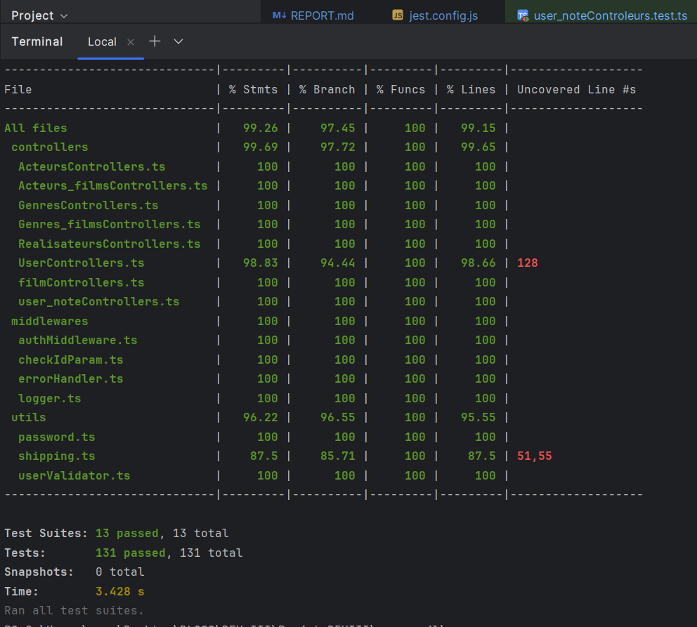

# RAPPORT — Projet Développement Informatique III

**Groupe 2TL1-7 :** Justin Aerts · Arnaud Peeters · Lucas Schenkel

---

## 1.Résumé de l'application

C'est un site de classement et de notation de films par les utilisateurs.

L'utilisateur peut parcourir un catalogue de films enrichi de données (réalisateur, acteurs, genres, durée, affiche), consulter la note moyenne calculée à partir des avis de la communauté, et gérer son profil personnel. Une fois inscrit et connecté, il peut :

- **noter** un film de 1 à 5 étoiles et laisser un commentaire,
- **gérer sa watchlist** en ajoutant ou retirant des films qu'il souhaite voir,
- **retrouver ses films notés** depuis son espace profil.

L'application est composée d'un front-end React (TypeScript + Vite) qui communique avec une API REST Node.js / Express (TypeScript) s'appuyant sur une base de données PostgreSQL via Sequelize.

---

## 2. Refactoring initial

### Code de base choisi

Le code retenu pour base du projet est celui de **Lucas Schenkel** qui a été copié dans un nouveau git pour le groupe.
Il constituait la base la plus avancée structurellement :
serveur Express fonctionnel, modèles Sequelize définis, routes et contrôleurs séparés,
et un début de gestion de l'authentification JWT.

### Difficultés d'adaptation pour les autres membres

**Justin Aerts** a rencontré des difficultés principalement sur deux points :

1. **L'organisation en modules ESM** (`"type": "module"` dans `package.json`) combinée à TypeScript obligeait à écrire les imports avec l'extension `.js` dans le code source (ex. `import Film from './models/Films.js'`), ce qui est contre-intuitif quand on travaille avec des fichiers `.ts`.
2. **Le pattern Singleton** appliqué à la connexion Sequelize (classe `Database` avec `getInstance()`) n'était pas immédiatement lisible pour quelqu'un habitué à exporter directement l'instance.


---
**Flux résumé :**

1. Un push sur n'importe quelle branche déclenche le pipeline CI : installation des dépendances et exécution de la suite de tests Jest. Si un test échoue, le merge est bloqué.
2. Un push sur `main` déclenche en plus le pipeline CD : le front-end React est compilé (`vite build`) puis déployé par SCP directement dans le répertoire servi par Nginx sur le VPS.
3. Le back-end est conteneurisé avec Docker (image `node:18-alpine`). L'image compile le TypeScript au build, puis démarre le serveur Express sur le port `3000`.
4. Nginx joue le rôle de reverse proxy : il sert les fichiers statiques du front-end et redirige les requêtes `/api/` vers le conteneur Docker.

---

## 4. Design Patterns utilisés

### Singleton — `src/config/database.ts`

La connexion à la base de données PostgreSQL est encapsulée dans une classe `Database` 
avec un constructeur privé et une méthode statique `getInstance()`.
Cela garantit qu'une seule instance de `Sequelize` est créée pour toute la durée de vie du serveur,
évitant les connexions multiples et les fuites de ressources.

---

### MVC (Model – View – Controller)

L'architecture du serveur suit le pattern MVC adapté à une API REST :

| Couche | Dossier | Rôle |
|---|---|---|
| **Model** | `src/models/` | Définition des entités Sequelize (Film, User, Genre…) |
| **Controller** | `src/controllers/` | Logique métier, lecture/écriture BDD, formatage des réponses |
| **View** | — | Remplacée par les réponses JSON (API REST sans rendu HTML) |
| **Router** | `src/routes/` | Mapping URL → contrôleur + application des middlewares |

**Pourquoi ici ?** Séparer les responsabilités rend le code testable indépendamment (on peut mocker les modèles pour tester les contrôleurs sans BDD réelle) et facilite la répartition du travail dans l'équipe.

---
## 5. Rapport de couverture de test (Coverage)

Les tests unitaires couvrent les utilitaires (`utils/`),tous les middlewares et tous les contrôleurs. La suite complète est lancée avec :

```bash
cd server && npx jest --coverage
```

Résultats obtenus :
le grand nombre de 100% pour les controlleurs, est dû au fait que ce ne sont que de simples créations et suppressions
qui sont soit vraie, soit fausse donc soit 0%, soit 100%.
```
------------------------------|---------|----------|---------|---------|-------------------
File                          | % Stmts | % Branch | % Funcs | % Lines | Uncovered Line #s 
------------------------------|---------|----------|---------|---------|-------------------
All files                     |   99.26 |    97.45 |     100 |   99.15 |                   
 controllers                  |   99.69 |    97.72 |     100 |   99.65 |                   
  ActeursControllers.ts       |     100 |      100 |     100 |     100 |                   
  Acteurs_filmsControllers.ts |     100 |      100 |     100 |     100 |                   
  GenresControllers.ts        |     100 |      100 |     100 |     100 |                  
  Genres_filmsControllers.ts  |     100 |      100 |     100 |     100 |                  
  RealisateursControllers.ts  |     100 |      100 |     100 |     100 |                  
  UserControllers.ts          |   98.83 |    94.44 |     100 |   98.66 | 128              
  filmControllers.ts          |     100 |      100 |     100 |     100 |                  
  user_noteControllers.ts     |     100 |      100 |     100 |     100 |                  
 middlewares                  |     100 |      100 |     100 |     100 |                  
  authMiddleware.ts           |     100 |      100 |     100 |     100 |                  
  checkIdParam.ts             |     100 |      100 |     100 |     100 |                  
  errorHandler.ts             |     100 |      100 |     100 |     100 |                  
  logger.ts                   |     100 |      100 |     100 |     100 |                  
 utils                        |   96.22 |    96.55 |     100 |   95.55 |                  
  password.ts                 |     100 |      100 |     100 |     100 |                  
  shipping.ts                 |    87.5 |    85.71 |     100 |    87.5 | 51,55            
  userValidator.ts            |     100 |      100 |     100 |     100 |                  
------------------------------|---------|----------|---------|---------|-------------------

Test Suites: 13 passed, 13 total
Tests:       131 passed, 131 total
Snapshots:   0 total
Time:        3.428 s

```
